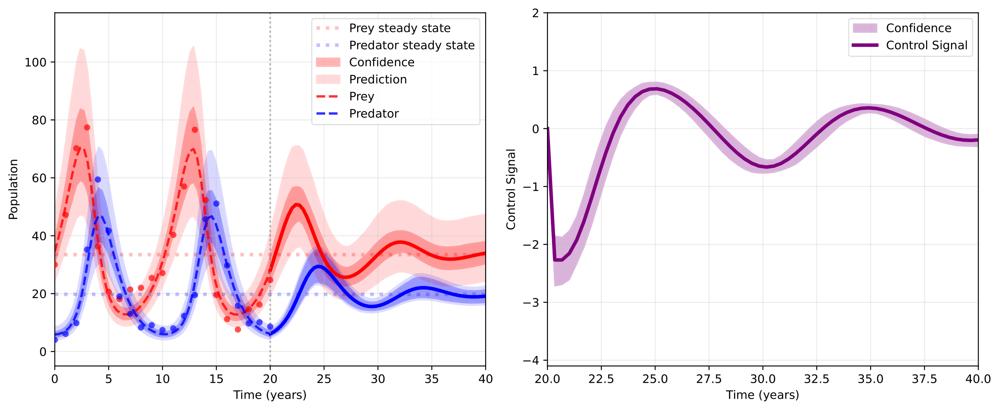

*By Nina Chafee, Micah Chandler, Benjamin Lebdaoui, and Meredith Orton*

*Advised by Dr. John Darges*

## How can we maximize our harvest without endangering the local wolf and bunny populations?

### Introduction
We're farmers, and we have a big problem! Every spring, the rabbit population skyrockets, decimating our crops, which means we don't have quite enough food to feed everyone. We could douse the crops in rabbit-killing pesticides, but unfortunately, we actually care about the environment and its inhabitants---particularly the local population of wolves. Negatively impacting the rabbit population too much depletes their food source, and could drive both populations to extinction. So, as much as possible, how can we preserve the local ecosystem _and_ reduce the bunny boom? You may find this video illuminating: [Poster Blitz Video](https://drive.google.com/file/d/1Trk_DmEuz1xbErP1mdDC6G8aOCIjqAA1/view?usp=sharing)

### Very Educated Guessing
To predict the impact of possible interventions, we first need to understand the dynamics of the system. We can do this by modeling the population dynamics between the bunnies and the wolves with the Lotka-Volterra Model:

$$\frac{dx}{dt} = \theta_1 x - \theta_2xy$$

$$\frac{dy}{dt} = -\theta_3 y + \theta_3 xy$$

$$x(0) = x_0, \quad y(0) = y_0,$$

where $\theta_1,\theta_2,\theta_3,\theta_4, x_0, y_0$ are the parameters that govern the dynamics of this system. 

Of course, in the real world, we don't know what these governing parameters are! All we have access to is noisy and often incomplete data. From that data, we need to perform **parameter estimation** to obtain the parameters that will make the model reproduce the data we've observed (*psst* this is an inverse problem*).

#### Deterministic Approach
We assume that our parameters are fixed unknowns. We want to minimize the distance between the output of our model and the data we are observing, measured with the Ordinary Least Squares (OLS) Estimator:

$$\theta_{OLS} = argmin_{\theta}\sum_{i= 1}^N(F(x_i;\theta)-d_i)^2,$$
where $\theta$ is parameter vector $[\theta_1,\theta_2,\theta_3,\theta_4,x_0,y_0]$, $F(x;\theta)$ is our model, and $d$ is our data.

We use data 20 years of local bunny and wolf populations. Note that we use synthetic data, so we know the true parameters for this experiment.

#### Bayesian Approach
We'll assume our parameters are random variables, and we want to construct posterior distributions for our parameters; that is, what parameters are likely and how likely are they?

Using **Bayes' theorem**, we combine prior knowledge with observed data:

$$p(\theta\mid data) = p(data\mid\theta) \cdot p(\theta)$$

Where:
- $p(\theta\mid data)$ = posterior distribution (what we want)
- $p(data\mid \theta)$ = likelihood (how well parameters explain data)
- $p(\theta)$ = prior distribution (our initial beliefs about parameters)

This gives us:
- Robustness to noise
- Prior knowledge incorporation
- Full uncertainty propagation

We do this through Markov Chain Monte Carlo (MCMC) Methods. Since we can't directly calculate $p(\theta \mid data)$, MCMC creates a "chain" of parameter samples that eventually converges to the true posterior distribution.

**Metropolis-Hastings Algorithm**
Proposal distribution: $q(\theta_j , \theta_{j-1})$
Target distribution: $\Pi_{post}(\theta \mid d)$
Steps:
1) $\theta_j$ , sample $\theta^* \sim q(\theta_j)$
2) Evaluate quality of $\theta^*$ compared to $\theta_j$ using $\Pi_{post}$
3) Based on evaluation accept $\theta_{j+1} = \theta^*$ or reject $\theta_{j+1} = \theta_j$

Now we predict the future behavior of the bunny and wolf populations for the next 20 years to model future control strategies, and we can construct confidence and prediction intervals to quantify uncertainty from the noisy data:

### Taking back the farm
**Goal:** limit the bunny boom in the spring without hurting the ecosystem! We can do this by driving the system of rabbits and wolves towards an equilibrium which will smooth population fluxuations without forcing either population to extinction.

Controls, denoted $\alpha(t)$, are actions that we take to change the system. The *cost function* measures how unfavorable controls are. The **optimal control** is the one that minimizes the cost function:

$$u(t) = \text{argmin} C_{x,t}(\alpha).$$

The cost function $C_{x,t}(\alpha)$ is often the sum of two parts: a measure of the control's success $g(x(T))$ at the end state, and an integral measuring the control's running cost. 

$$C_{x,t}(\alpha) = g(x(T)) + \int_{t_0}^{T} L(x(t), \alpha(t), t)$$

While there are a few approaches to control Lotka-Volterra systems, we chose removal and addition of wolves to the system.

$$\frac{dx}{dt} = ax - bxy$$

$$\frac{dy}{dt} = -cy + dxy - u(t).$$

Cost function:

$$C(\alpha) = (p(T) - \frac{\theta_3}{\theta_4})^2 + (r(T) - \frac{\theta_1}{\theta_2})^2 + \int_0^T\alpha(t)^2dt$$

To propagate uncertainty, we run optimal control on each sample generated with MCMC, so we can create a posterior distribution of the optimal controls as well. We can then create confidence intervals with the standard deviation at each time point across some 5,000 samples.

#### Pseudo Spectral Method

We approximate our control and states using orthonormal Legendre polynomials, then substitute these approximations into our cost function and dynamical constraints to turn our ODE system into an algebraic one. Once this is done, we can use Gauss quadrature to optimize the new cost function, subject to the new dynamical constraints.

#### Pontryagin Maximal Principle

After constructing the Hamiltonian, we formulate the optimal control in terms of the costate variable, $\lambda$. We can then use the Shooting Method which utilizes an initial guess, $\lambda_0$, then uses root-finding to find the right value for $\lambda$ that satisfies the boundary conditions.

### So what did we do?
We have created a full pipeline to take in noisy data, estimate the parameters of a model, derive and implement an optimal control for the system, and propagate uncertainty to quantify the confidence in our decision-making.

Poster: [Download the Poster (PDF)](Poster.pdf)

Slides: [Download the Midterm Presentation (PDF)](Midterm_Presentation.pdf)